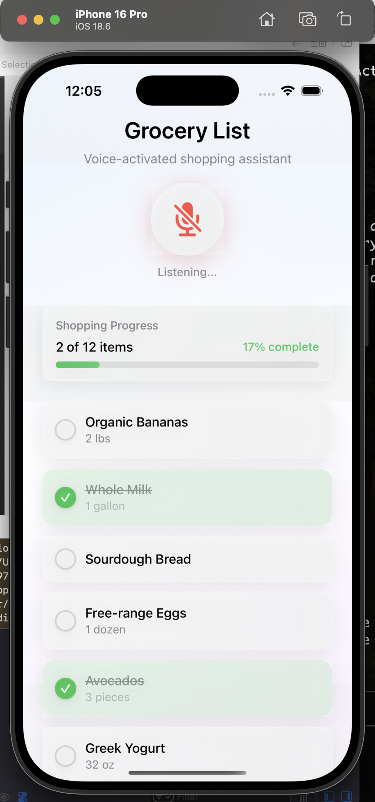
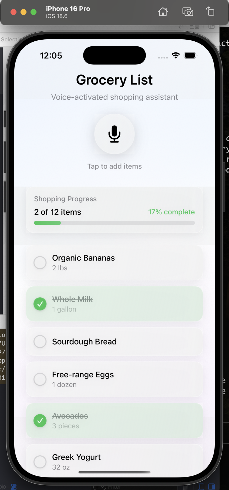

# Voice-Activated Grocery List iOS App

A beautiful, modern iOS grocery list application built with SwiftUI, featuring glassmorphism design and voice-activated item management. Optimized for iPhone 16 Pro Max with native iOS design patterns.

## ✨ Features

- **🎙️ Voice Recording** - Large, animated circular button with three states (idle, recording, processing)
- **✨ Glassmorphism Design** - Modern iOS glass material effects with backdrop blur and transparency
- **📋 Smart List Management** - Interactive grocery items with smooth checkbox animations
- **📊 Progress Tracking** - Sticky progress bar showing completion percentage and item counts
- **📱 Mobile-Optimized** - Native iOS experience with proper safe areas and iPhone 16 Pro Max optimization
- **🎨 Beautiful UI** - Radial gradients, subtle shadows, and professional visual effects

## 🛠 Technology Stack

- **SwiftUI** - Declarative UI framework
- **iOS 18.5+** - Latest iOS features and APIs
- **Swift 5.0** - Modern Swift language features
- **Combine** - Reactive programming for state management
- **SF Symbols** - Apple's icon system for consistent design

## 📱 Screenshots

<div align="center">
  
  
</div>

*Beautiful glassmorphism design with voice-activated grocery list management*

## 🚀 Getting Started

### Prerequisites

- Xcode 16.4 or later
- iOS 18.5 or later
- iPhone 16 Pro Max (recommended) or compatible iOS device/simulator

### Installation

1. Clone the repository:
   ```bash
   git clone https://github.com/mauricioTechDev/voice-activated-grocery-list-ios.git
   cd voice-activated-grocery-list-ios
   ```

2. Open the project in Xcode:
   ```bash
   open first-ios-ai-app.xcodeproj
   ```

3. Select your target device or simulator

4. Build and run the project (`⌘ + R`)

## 🏗 Architecture

The app follows modern SwiftUI architectural patterns:

### Core Components

- **`ContentView`** - Main app interface with glassmorphic layout
- **`GroceryListViewModel`** - ObservableObject managing app state and business logic
- **`VoiceRecordingButton`** - Animated voice recording interface component
- **`GroceryListItem`** - Individual grocery item with custom checkbox and animations
- **`ProgressBar`** - Sticky completion progress tracker
- **`GlassmorphicModifier`** - Reusable ViewModifier for consistent glass effects

### File Structure

```
first-ios-ai-app/
├── ContentView.swift                 # Main app interface
├── GroceryItem.swift                # Data model for grocery items
├── RecordingState.swift             # Voice recording state enum
├── GroceryListViewModel.swift       # State management (ObservableObject)
├── VoiceRecordingButton.swift       # Voice recording UI component
├── GroceryListItem.swift           # Individual grocery item component
├── ProgressBar.swift               # Progress tracking component
├── GlassmorphicBackground.swift    # Background gradients and overlays
├── GlassmorphicModifier.swift      # Reusable glassmorphism styling
└── first_ios_ai_appApp.swift       # App entry point
```

## 🎨 Design System

### Glassmorphism Implementation

The app uses a custom glassmorphism design system featuring:

- **Backdrop Blur** - `.ultraThinMaterial` with custom blur effects
- **Transparency Layers** - Configurable opacity levels (20-40%)
- **Gradient Overlays** - Subtle white gradients for depth
- **Consistent Styling** - Reusable `.glassmorphic()` modifier

### Animation System

- **Voice Button States** - Pulse animation during recording, spin during processing
- **Touch Feedback** - Scale animations on press for interactive elements
- **Completion Animations** - Smooth state transitions for checked items
- **Progress Updates** - Animated width changes for progress bar

## 📋 Usage

1. **Adding Items** - Tap the large microphone button to simulate voice recording
2. **Managing Items** - Tap checkboxes to mark items as complete/incomplete
3. **Progress Tracking** - View completion progress in the sticky header bar
4. **Voice Recording** - Experience three distinct button states:
   - **Idle** (gray) - Ready to record
   - **Recording** (red, pulsing) - Listening for voice input
   - **Processing** (blue, spinning) - Processing voice data

## 🧪 Testing

The project includes comprehensive testing setup:

- **Unit Tests** - Swift Testing framework in `first-ios-ai-appTests/`
- **UI Tests** - XCTest framework in `first-ios-ai-appUITests/`

Run tests in Xcode with `⌘ + U` or use the command line:
```bash
xcodebuild test -project first-ios-ai-app.xcodeproj -scheme first-ios-ai-app -destination 'platform=iOS Simulator,name=iPhone 16 Pro Max'
```

## 🤝 Contributing

Contributions are welcome! This project was built following the design guidelines from a React implementation and translated to native SwiftUI.

### Development Guidelines

1. Follow Swift naming conventions (camelCase for variables, PascalCase for types)
2. Use the `.glassmorphic()` modifier for consistent styling
3. Implement proper SwiftUI state management patterns
4. Maintain iOS design system compliance
5. Add unit tests for new functionality

### Getting Help

- Check `CLAUDE.md` for detailed development guidance
- Review existing component implementations for patterns
- Follow SwiftUI best practices and iOS Human Interface Guidelines

## 📄 License

This project is licensed under the MIT License - see the [LICENSE](LICENSE) file for details.

## 🙏 Acknowledgments

- Design inspiration from modern glassmorphism trends
- React implementation as reference architecture
- SwiftUI community for best practices and patterns
- Apple's Human Interface Guidelines for iOS design standards

## 🔮 Future Enhancements

- [ ] Actual voice recognition integration
- [ ] Core Data persistence
- [ ] iCloud sync across devices
- [ ] Widget support for quick item addition
- [ ] Apple Watch companion app
- [ ] Accessibility improvements
- [ ] Multiple list support
- [ ] Smart categorization

---

Built with ❤️ using SwiftUI and modern iOS development practices.